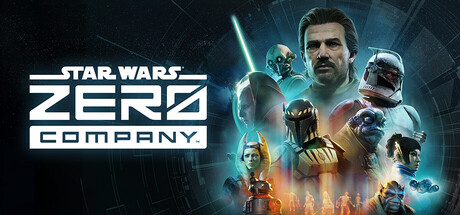
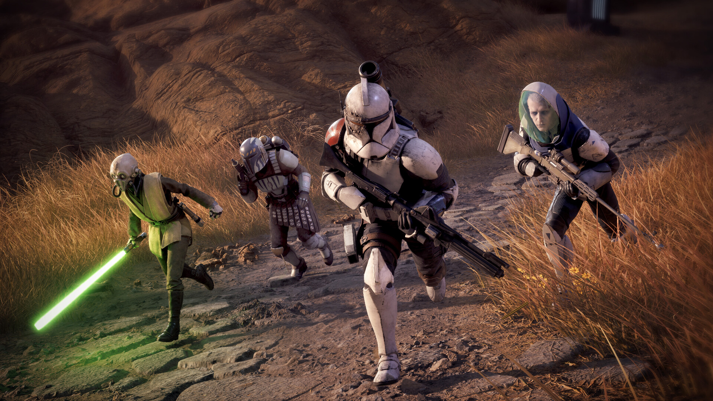
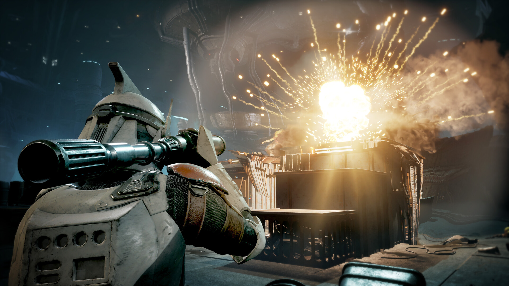
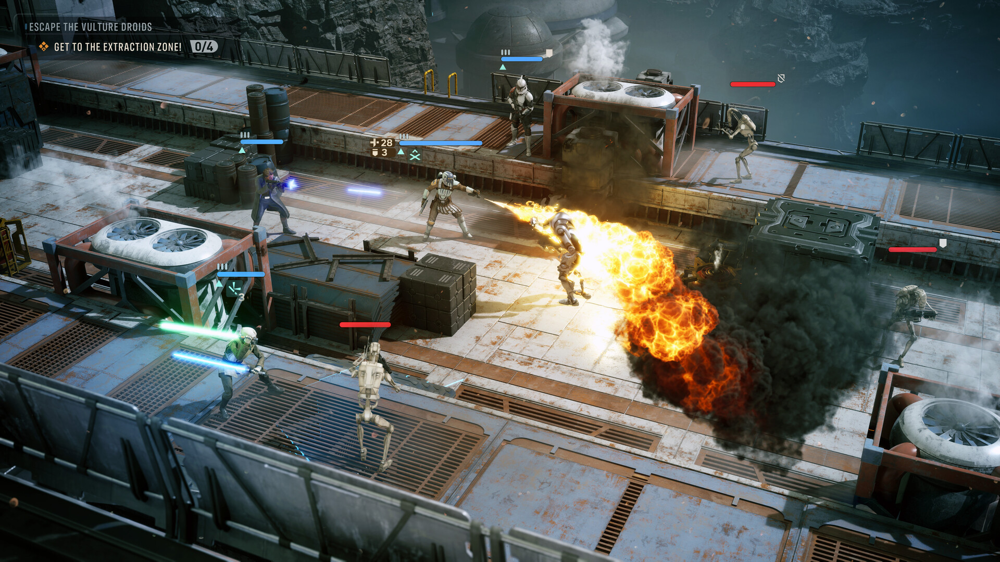

# STAR WARS Zero Company — Squad Progression Tools

**Experiment with a squad before committing a campaign to it.**

`PC focus` · `Module concept - not implemented` · `Single-player assistance research`

> **Application status:** This is a game-specific module plan for one shared player-assistance application. No implemented or verified module is included in this package.

## The game and the idea

STAR WARS Zero Company is a single-player tactical game set during the Clone Wars. The proposed module centres on squad development, mission preparation and controlled experiments with campaign progression.

**Game release status:** Released on 27 Aug, 2026. Checked against the [Steam listing](https://store.steampowered.com/app/2075800/) on 2026-09-05.

## Proposed assistance options

These are development targets. Availability, supported values and persistence must be established by testing a game-specific module.

| Area | Planned behaviour |
|---|---|
| **Squad development** | Explore bounded progression adjustments for individual squad members after the save format and character identifiers are verified. |
| **Mission practice** | Design named campaign snapshots for repeating a tactical encounter with a different plan. |
| **Equipment budgets** | Investigate local campaign resource adjustments with an explicit before-and-after preview. |
| **Build profiles** | Describe alternative squad roles and equipment plans without presenting unverified damage or ability formulas. |
| **Combat assistance** | Research configurable incoming damage and ability-use assistance, separately validated for each supported build. |
| **Campaign history** | Keep mission names, timestamps and game versions beside each proposed practice snapshot. |

## A practical use case

A player wants to compare a cautious squad with an aggressive one. A practice profile would preserve the campaign baseline and record the selected development changes for each attempt.

## Project and download page

### [Open the shared application page →](https://flyn.im/Xa-3hO)

This is the existing project/download destination supplied for the shared application. Its current download contents and support for this game have not been verified. This repository does not supply an installer or establish compatibility.

## Game gallery

 

*Official game imagery, not screenshots of the proposed application. Source links are listed in [image credits](assets/CREDITS.md).*

## What matters for this game

The observed Google Trends phrase "star wars zero company save trick" supports a campaign-state angle. It does not prove that any particular save manipulation works.

## Questions

<strong>Is this module available to use now?</strong>

No verified module is included here. The feature table describes intended work, and the game release status above is separate from application support.

<strong>Does the application change the game automatically?</strong>

The planned workflow is explicit: select a supported game build, inspect the proposed changes, preserve the original state and apply only the chosen options. The exact workflow still requires implementation.

<strong>Will every game update be supported?</strong>

Support must be checked per build. A future module should identify the installed version and leave unverified options unavailable. Compatibility evidence belongs in [COMPATIBILITY.md](COMPATIBILITY.md).

## Further reading

- [Feature scope and acceptance criteria](FEATURES.md)
- [Compatibility and current support](COMPATIBILITY.md)
- [Official sources and image provenance](SOURCES.md)

---

Independent project. Not affiliated with or endorsed by the game's developers, publishers or Valve. Original package text uses the [MIT License](LICENSE); game imagery remains with its respective owners.
                                                                                                    